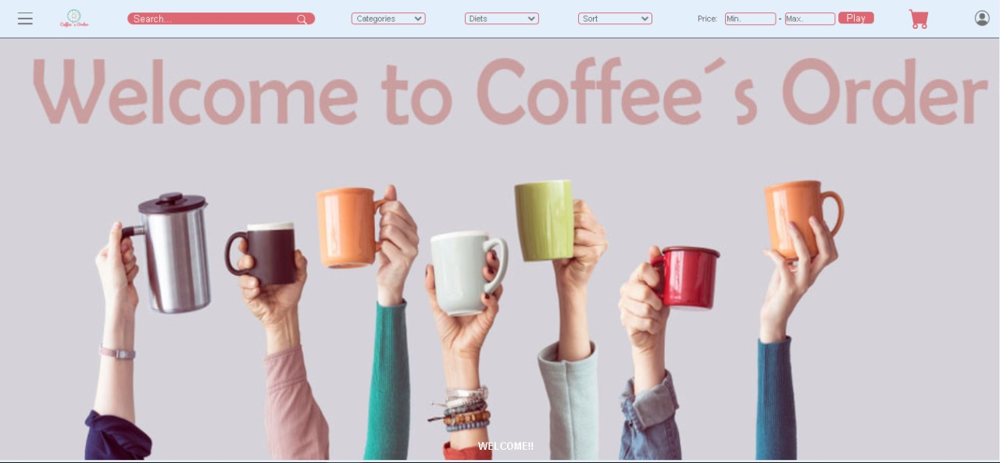
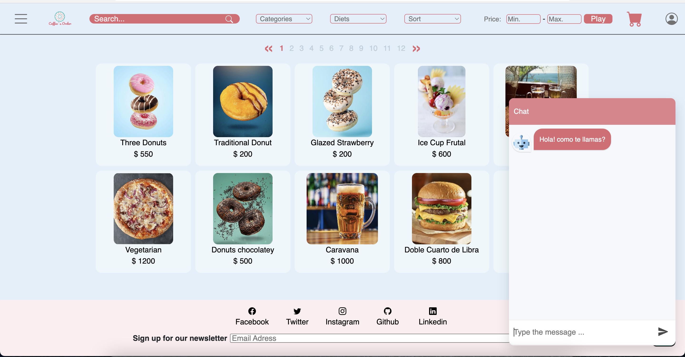

# __Grupal Project - Henry Coffee's Orders__




### Proyecto Full Stack de un e-commerce para comidas rápidas. 
Queremos desarrollar una página que permita dar fluidez y eficiencia en la toma de pedidos y su administración. Siendo ayuda tanto para el cliente como para el administrador del local.
El cliente podrá ver la carta y de acuerdo a ella ir eligiendo de forma dinámica los productos a consumir,mediante un carrito de comprars y su medio de pago (Mercado Pago). 
El administrador del local podrá gestionar movimiento de caja y stock.
Coffee`s Orders está orientado a satisfacer las necesidades de las cafeterías suscritas a nuestra aplicación y a sus clientes. 
Utilizamos herramientas como React, Redux, Sequelize entre otras.

Puedes acceder al sitio web desde el siguiente link: [Coffee´s Order](https://coffeemainapp.vercel.app/)

## Objetivos del Proyecto

- Construir una App utlizando React, Redux, Node entre otras.
- Afirmar y conectar los conceptos aprendidos en la carrera.
- Aprender mejores prácticas.
- Aprender y practicar el workflow de GIT.
- Practicar métodos de SCRUM.
- Usar y practicar testing.

## Autores

- [Luciana Soledad Diaz](https://www.linkedin.com/in/luciana-soledad-diaz/)
- [Jonathan Daniel Pérez](https://www.linkedin.com/in/jonathanperezfrontenddeveloper/)
- [Rodrigo Hernández](https://www.linkedin.com/in/rodrigo-hernandez-4a8b5523b/)
- [Carlos Solá Zambrano](https://www.linkedin.com/in/carlos-sol%C3%A1-zambrano-228093224/)
- [Néstor Arias Cataldi](https://www.linkedin.com/in/n%C3%A9stor-arias-cataldi-815b4411a/)
- [Gaspar Pérez](https://www.linkedin.com/in/gaspar-perez-9006a5239/)
- [Matías Dentoni](https://www.linkedin.com/in/mat%C3%ADas-hern%C3%A1n-dentoni-5a2941125/)

# Correr la App localmente
## BoilerPlate

El boilerplate cuenta con dos carpetas: `api` y `client`. En estas carpetas estará el código del back-end y el front-end respectivamente.

En `api` crear un archivo llamado: `.env` que tenga la siguiente forma:

```env
DB_USER = postgres
DB_PASSWORD = SU PASSWORD
DB_HOST = localhost:5432
PORT = 3001
FRONT = 3000
SECRET = pepito
DB_NAME=coffee
FRONTEND_URL=http://localhost:3000
ACCESS_TOKEN = "TEST-4244633596829734-092014-6ba221809cba6b90a563f64fd0e65d84-176832394"
```

__``Opción 1:`` Desde la consola creamos nuestra base de datos__

```psql
psql
```
Luego:
```sequelize
CREATE DATABASE coffee
    WITH
    OWNER = postgres
    ENCODING = 'UTF8'
    CONNECTION LIMIT = -1
    IS_TEMPLATE = False;

Clona el proyecto

```bash
git clone https://github.com/PF-Coffee-main.git
```

En el directorio del proyecto

```bash
cd PF-Coffee-main
```

Instala las dependencias en ambas carpetas (API y CLIENT)

```bash
cd api/
   npm install
cd ..
cd client/
   npm install
```

Start el servidor

Front
```bash
cd client/
   npm start
```
Back
```bash
cd api/
   npm start
```
__Recordar__

Reemplazar `postgres` y `SU PASSWORD` con tus propias credenciales para conectarte a postgres.
Para este caso sería reemplazar el ``PASSWORD``.
Este archivo va ser ignorado en la subida a github, ya que contiene información sensible (las credenciales).

Adicionalmente será necesario que creen desde psql una base de datos llamada __`coffee`__.

El contenido de `client` fue creado usando: Create React App.


#### Tecnologías necesarias

- [ ] React
- [ ] Redux
- [ ] FireBase
- [ ] MercadoPago
- [ ] Nodemailer
- [ ] Express
- [ ] Sequelize - Postgres 

